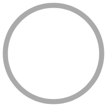
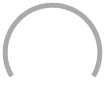
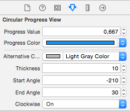

# DRCircularProgress (iOS)

Circular progress view for iOS apps. Compatible with iOS 7 and later, tested under iOS 7 and iOS 8.

 

## Features

- Compatible with iOS 7 and iOS 8
- Build using `CAShapeLayer`
- Configurable:
    - progress and "empty" colors
    - thickness
    - start and end angle (can draw circle, arch, or even ellipse when it's frame is not a square)
    - progress direction (clockwise or counter-clockwise)
- Supports Core Animation for animating progress changes:

```obj-c
DRCircularProgressView *progressView = ...
[UIView animateWithDuration:3 animations:^{
    progressView.progressValue = 1.f; 
}];
```

- Configuration and live preview in Interface Builder (uses `IB_DESIGNABLE` and `IBInspectable`, tested under Xcode 6.3.1):



## Instalation

You can integrate `DRCircularProgress` with your project using Cocoapods. To do so, you will need to add one of the following lines to your Podfile:

For most recent or development version:

    pod 'DRCircularProgress', :git => 'https://github.com/darrarski/DRCircularProgress-iOS.git'

For specific version:

    pod 'DRCircularProgress', :git => 'https://github.com/darrarski/DRCircularProgress-iOS.git', :tag => 'VERSION_TAG'

Where `VERSION_TAG` you should put tag name for given version (ex. "v1.0.0"). It is recommended to set version explicity instead of using most recent version, as backward compatibility is not warranted.

You can also download zip archive of given release from [releases page](https://github.com/darrarski/DRCircularProgress-iOS/releases).

## Usage

Check out included example project.

## Changelog

##### v1.0.3

> - Updated layers animation logic, to make setting progress without animation possible

##### v1.0.2

> - Fixed: preserving state after animating progress

##### v1.0.1

> - Fixed: crash when size is set to `CGRectZero`

##### v1.0.0

> - Allows to configure start/end angle, counter-/clockwise progress direction
> - Supports configuration and live preview in Interface Builder (uses `IBInspectable` and `IB_DESIGNABLE`)

##### v0.1.0

> - Initial release
> - iOS 7 and iOS 8 compatible
> - Supports animated progress change

## License

The MIT License (MIT) - check out included [LICENSE](LICENSE) file.
